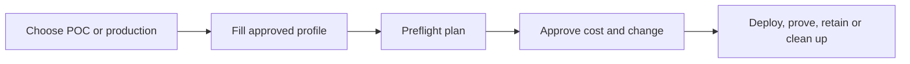

# Taipan Azure vWAN Accelerator

An evidence-first accelerator for deploying, testing, proving, and operating an Azure Virtual WAN secured hub with Azure Firewall.

It is designed for teams that want an enterprise starting point without editing infrastructure module code.

## Start here

1. Read [Start Here](docs/START-HERE.md).
2. Choose the [POC or production profile](config/profiles/PROFILES.md).
3. Bootstrap customer-owned Terraform state with [Bicep](bootstrap/state/bicep/main.bicep).
4. Run the cost-gated POC lifecycle or use the future approved CI/CD path.

## What is available now

| Capability | Status |
| --- | --- |
| One secured vWAN hub, Azure Firewall, Firewall Policy, and routing intent | Terraform plan validated |
| Customer-owned Azure Storage Terraform state bootstrap | Bicep compiled and validated |
| Separate temporary two-spoke acceptance-test harness | Implemented |
| Private allow/deny and controlled Internet egress verification | Implemented |
| Log Analytics evidence and exported `REPORT.md` | Implemented |
| POC lifecycle with cost cap and automatic cleanup | Implemented |
| Two-to-four hub profiles, Bicep network parity, dashboards, GitHub Actions, Azure DevOps | Planned |

No workload, vWAN, Firewall, test VM, or customer data resource is currently deployed from this repository.

## User experience

Customers make architecture decisions through profiles and approvals; they do not modify Terraform module code.

## Guides

- [Customer onboarding](docs/operations/CUSTOMER-ONBOARDING.md)
- [Secured-hub topology](docs/architecture/TOPOLOGY.md)
- [POC and production user journey](docs/operations/USER-JOURNEY.md)
- [Evidence and acceptance results](docs/testing/EVIDENCE.md)
- [Architecture contract](docs/architecture/ARCHITECTURE-CONTRACT.md)
- [Deployment gate and cost controls](docs/operations/DEPLOYMENT-GATE.md)

## Safety and ownership

- The customer owns the Azure subscription, Entra identities, Terraform state account, approvals, and deployed resources.
- This repository must never contain state, plans, credentials, certificates, customer IP ranges, or production values.
- The POC path is time-boxed and destroys all billable test resources after evidence collection.
- Terraform and Bicep must never manage the same Azure resources in one environment.
