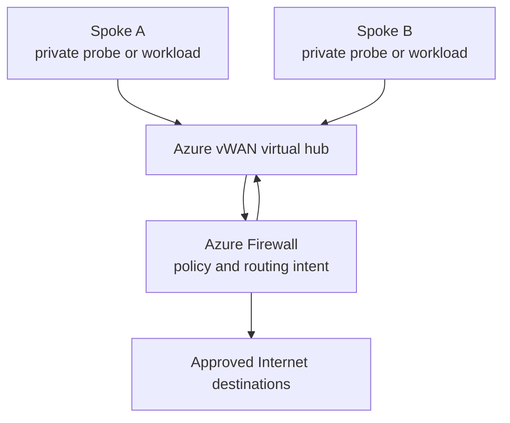
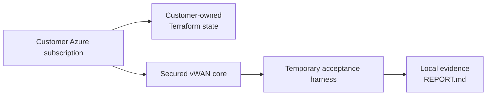

# Secured-hub topology

## First deployment profile

The hub uses routing intent to direct private and Internet-bound traffic through Azure Firewall. The test harness connects temporary spokes to the same hub, proving that inspection and routing work before a customer connects workloads.

## What is deliberately separate

The core and test harness use separate Terraform states. This prevents test cleanup from accidentally destroying the retained production core.

## Growth path

The first profile is one hub. The architecture contract reserves the same naming, profile, test, evidence, and lifecycle patterns for two, three, or four hubs. Multi-region resilience is a later profile, not an untested checkbox in the initial release.
