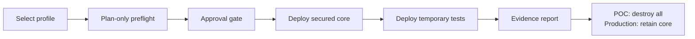

# POC and production user journey

## POC

The POC is intended for a short, approved session. The runner deploys the core first, then the isolated test harness. If the acceptance result is successful, it saves evidence and destroys both the test harness and core.

## Production

Production begins from an approved profile and CI/CD workflow. The secured core remains. The temporary test harness is created only to prove the change, then removed. Every production apply must have an approved plan, change record, named owner, and cost allocation.

## Failure behaviour

If the core cannot deploy, the test harness does not start. If a test fails, evidence remains in the local artifacts folder and the configured cleanup path runs. This prevents an incomplete POC from being mistaken for a proven design.
